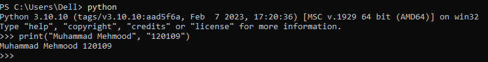
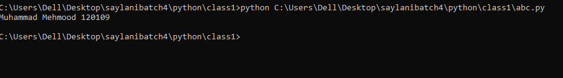
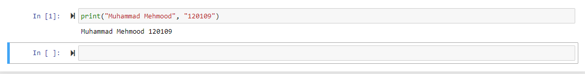
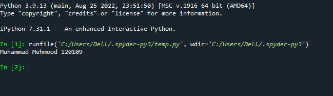
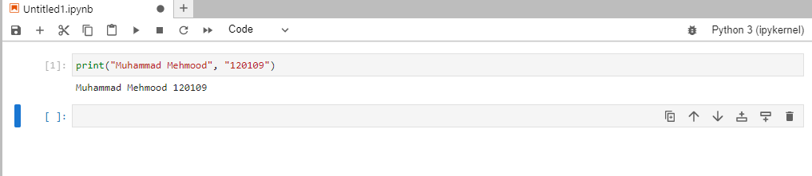
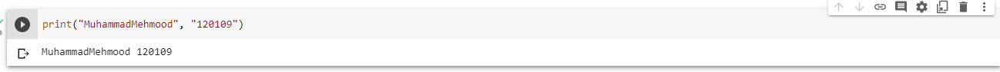

# Python Hello world Class1
# Installation
* Anaconda
    * check on env path
    * select installation for all user
* VS Code
## Step1: Console
* search
    * anaconda
        * conda prompt
            * python
                ```
                print("Hello World")
                ```
            
## Step2: Create physical file filename.py
* Create your directly (Folder)
    * go to address -> remove address (press delete)
        * `cmd` -> `code .`
            * EXPLORE Tab
                * Create newfile -> newfilename.py
                    * status bar -> python -> base 3.9.*
                        * click on **Play Button**
                        * copy file path -> cd path paste
                            * python **filename.py** 
                        
## Step3: Create Jupyter notebook file
* Conda prompt 
    * jupyter notebook
        * right top **new** -> python3
        
## Step4: Create file with Spyder and other IDE (pycharm, rstudio)
* Anaconda Navigator (GUI)


## Step5: Create File with Jupyter labe
* conda prompt -> cd path
* `jupter lab`


## Step6: Create File with Google Colab
* google -> google colab -> login with your google account
